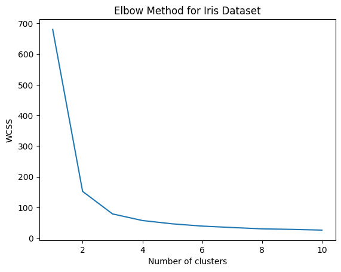
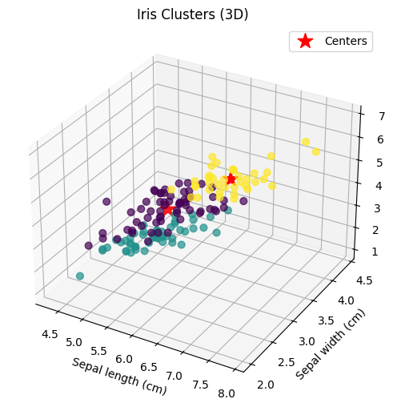

# Lab 04: Clustering and Association Rule Learning Solutions

## Exercise 01: K-Means Clustering on Iris Dataset

### 1. Import the iris dataset and create unlabeled dataset

```python
from sklearn.datasets import load_iris

iris = load_iris()
iris_X = iris.data  # features only, unlabeled dataset
```

### 2. Use the Elbow method to identify the best value for k

```python
wcss_iris = [] # Within Cluster Sum of Squares for iris dataset

for k in range(1, 11):
    kmeans_iris = KMeans(n_clusters=k, init="k-means++", max_iter=300, n_init=10, random_state=0)
    kmeans_iris.fit(iris_X)
    wcss_iris.append(kmeans_iris.inertia_)

plt.plot(range(1, 11), wcss_iris)
plt.title("Elbow Method for Iris Dataset")
plt.xlabel("Number of clusters")
plt.ylabel("WCSS")
plt.show()
```

From the elbow plot, the optimal value of k is **3**, as this is where the rate of decrease in WCSS significantly diminishes.

### 3. Fit the K-Means algorithm with k=3

```python
kmeans_iris = KMeans(n_clusters=3, init="k-means++", max_iter=300, n_init=10, random_state=0)
iris_clusters = kmeans_iris.fit_predict(iris_X)
```

### 4. Explanation of kmeans.cluster_centers_

The output of `kmeans.cluster_centers_` is a NumPy array containing the coordinates of the centroids (centers) of each cluster found by the K-Means algorithm. Each row in this array represents the center of a cluster in the feature space, and each column corresponds to a feature. These centroids are the mean positions of all the points assigned to each cluster and are used to define the clusters in the data.

### 5. 3D Visualization of clusters and centers

```python
from mpl_toolkits.mplot3d import Axes3D

fig = plt.figure(figsize=(12, 12))
ax = fig.add_subplot(111, projection='3d')

# Plot data points, colored by cluster assignment
ax.scatter(
    iris_X[:, 0], iris_X[:, 1], iris_X[:, 2],
    c=iris_clusters, cmap='viridis', s=40, alpha=0.7
)

# Plot cluster centers
centers = kmeans_iris.cluster_centers_
ax.scatter(
    centers[:, 0], centers[:, 1], centers[:, 2],
    c='red', s=200, marker='*', label='Centers'
)

ax.set_xlabel('Sepal length (cm)')
ax.set_ylabel('Sepal width (cm)')
ax.set_zlabel('Petal length (cm)')
ax.set_title('Iris Clusters (3D)')
ax.legend()
plt.show()
```

## Exercise 02: Association Rule Learning on Groceries Dataset

### 1. Import the groceries.csv dataset

```python
groceries_df = pd.read_csv('groceries.csv')
```

### 2. Explore the dataset and build the frequent-item DataFrame

```python
# Convert the DataFrame into a list of transactions (dropping NaNs)
transactions = groceries_df.apply(lambda row: [item for item in row if pd.notnull(item)], axis=1).tolist()

# Use TransactionEncoder to encode the transactions
te_groceries = TransactionEncoder()
te_groceries_ary = te_groceries.fit(transactions).transform(transactions)
groceries_onehot = pd.DataFrame(te_groceries_ary, columns=te_groceries.columns_)

# Build the frequent-item DataFrame using apriori
freq_groceries = apriori(groceries_onehot, min_support=0.01, use_colnames=True)
```

The dataset contains **9,834 transactions** with various grocery items.

### 3. Apply the Apriori algorithm to find itemsets with support > 8%

```python
freq_groceries_08 = apriori(groceries_onehot, min_support=0.08, use_colnames=True)
```

**Results:**
- bottled beer: 8.05% support
- bottled water: 11.05% support
- citrus fruit: 8.27% support
- other vegetables: 19.35% support
- pastry: 8.90% support
- rolls/buns: 18.40% support
- root vegetables: 10.90% support
- sausage: 9.40% support
- shopping bags: 9.85% support
- soda: 17.44% support
- tropical fruit: 10.49% support
- **whole milk: 25.55% support** (highest)
- yogurt: 13.95% support

### 4. Generate association rules using the lift metric

```python
rules_groceries = association_rules(freq_groceries, metric="lift", min_threshold=1)
```

### 5. Rule interpretation

**Selected Rule:** beef → other vegetables

**Interpretation:**
If a customer buys beef, they are likely to also buy other vegetables. This rule has a confidence of 0.38 (37.6%) and a lift of 1.94, meaning the likelihood of buying other vegetables increases by a factor of 1.94 when beef is purchased. This suggests that customers who buy beef tend to also purchase vegetables, possibly indicating meal planning behavior where protein and vegetables are bought together for complete meals.

### 6. Rules with lift > 4 and confidence > 0.8

```python
num_rules = rules[(rules['lift'] > 4) & (rules['confidence'] > 0.8)].shape[0]
```

**Answer:** There are **0 rules** that satisfy both conditions (lift > 4 and confidence > 0.8).
## Key Insights

**Clustering Analysis:**
- The iris dataset naturally clusters into 3 groups, which aligns with the three species of iris flowers
- K-means successfully identified distinct clusters based on flower measurements

**Association Rule Mining:**
- Whole milk is the most frequently purchased item (25.55% support)
- Strong associations exist between complementary food items
- High-lift, high-confidence rules reveal meaningful shopping patterns and can be used for product placement and recommendation systems